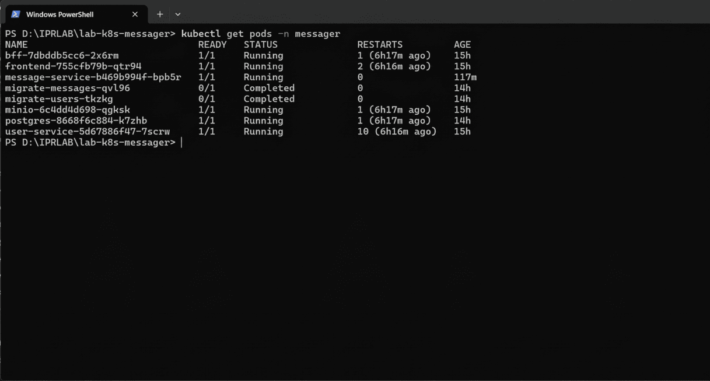
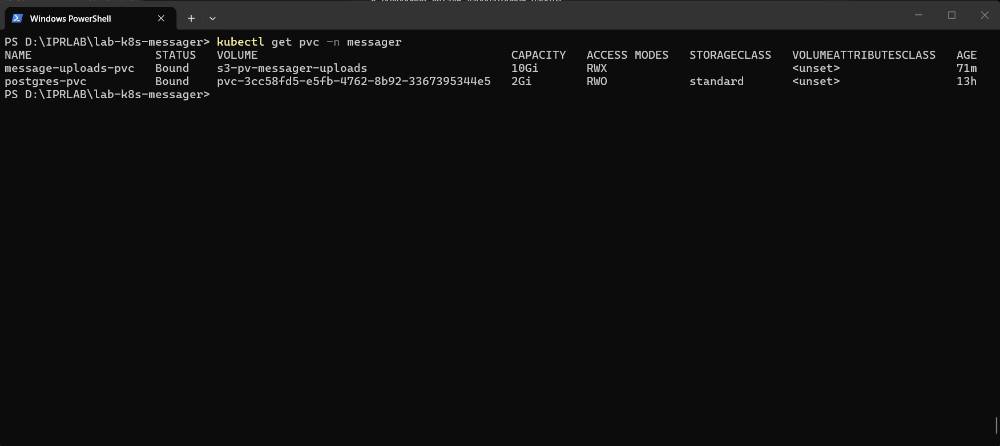
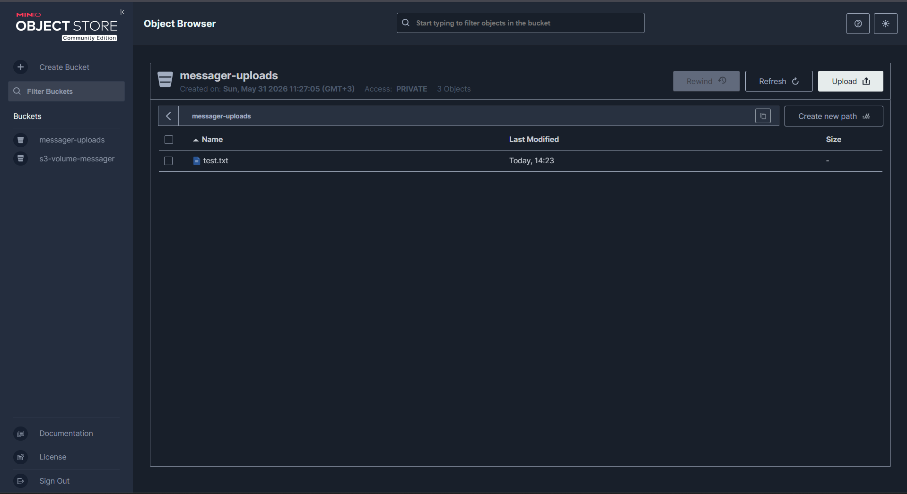
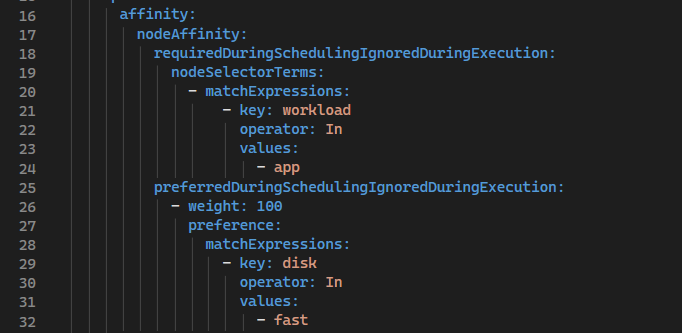
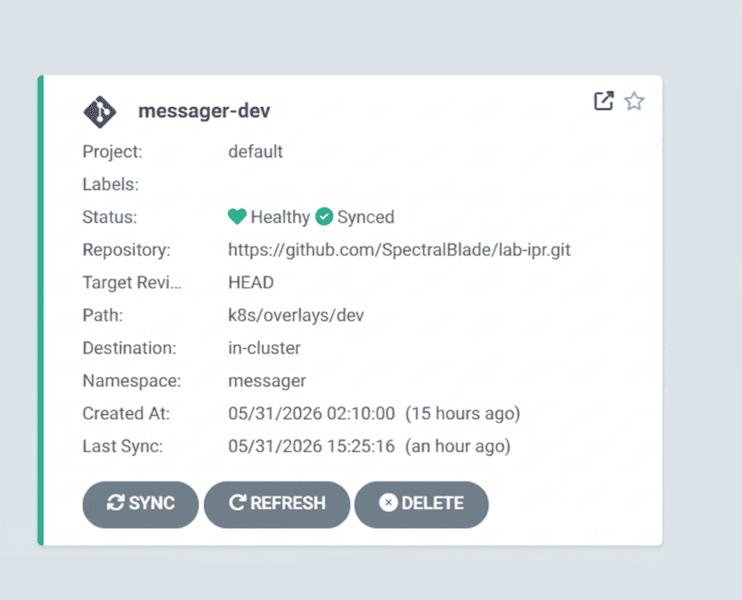

# Подробные детали лабораторной работы

## Особенности S3 CSI (Драйвер)
Установка драйвера производилась на базе форка `ch.ctrox.csi.s3-driver`. 
В процессе настройки статического PV (PersistentVolume) было выявлено, что использование дефолтного монтировщика `rclone` приводит к ошибкам `The specified key does not exist` при обращении к пустому бакету. Для стабильной работы был применен монтировщик `s3fs` и жестко задан `endpoint` на внутренний DNS-адрес MinIO кластера (`http://minio.messager.svc.cluster.local:9000`), а также отключен параметр `bucketName`, чтобы драйвер монтировал корень бакета напрямую через `volumeHandle`.

## Состояние `pods`
Все компоненты успешно запущены и работают. Под `message-service` успешно примонтировал S3-диск.

## Связка PV и PVC
Запрос на хранилище успешно связан с нашим статическим PV. Отключен дефолтный StorageClass для принудительной связки.

## S3 CSI (MinIO)
Доказательство того, что драйвер имеет доступ к хранилищу, а бакет создан и функционирует:

## Node Affinity
Настроено распределение подов по узлам. В рамках среды Docker Desktop все метки (`workload=system`, `workload=app`, `disk=fast`) были применены к единой ноде `docker-desktop` для демонстрации работы механизма.

## Kustomize
Структура разделена на базовые манифесты (`base`) и оверлеи (`overlays/dev`). В оверлее применяются специфичные патчи ресурсов, задается namespace и генерируются ConfigMap.

## Argo CD (GitOps)
- Манифест: [application.yaml](../../argocd/application.yaml)
- GitOps-процесс устроен так: Kubernetes-манифесты хранятся в Git-репозитории как единственный источник истины. Argo CD следит за папкой `k8s/overlays/dev`, и при изменениях в репозитории автоматически синхронизирует состояние кластера (Auto-Sync, Prune, Self-Heal).

### Статусы

